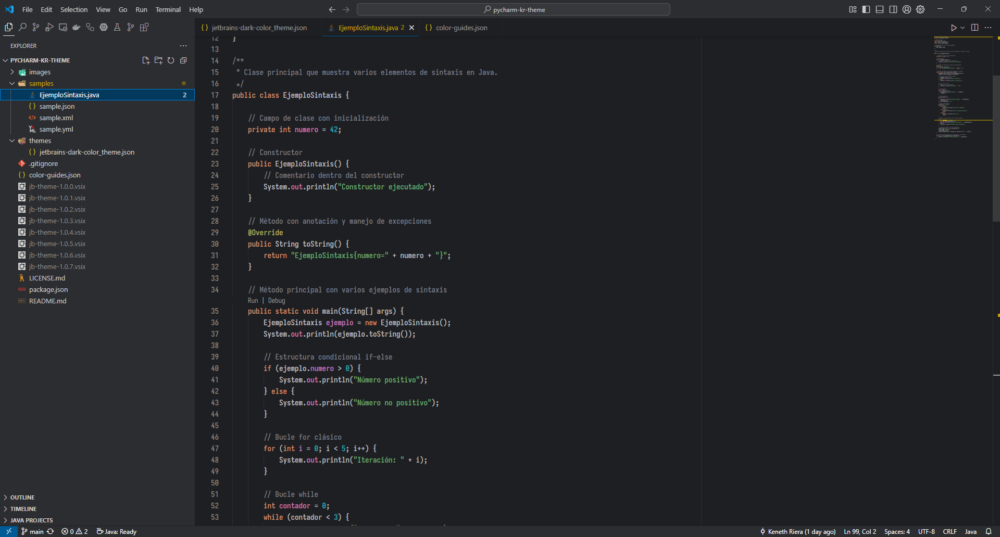

# JetBrains Theme

Un tema elegante para VSCode inspirado en la estética de JetBrains. Diseñado para brindar una experiencia visual impecable, este tema resalta cada detalle de tu código para mejorar la legibilidad y el enfoque durante el desarrollo.

## ✨ Características

- 🎨 **Colores cuidadosamente seleccionados** inspirados en la paleta de JetBrains
- 🌙 **Tema oscuro** optimizado para largas sesiones de programación
- 🔤 **Sintaxis highlighting** para múltiples lenguajes de programación
- 👀 **Alta legibilidad** con contraste equilibrado
- 🎯 **Enfoque en la productividad** con elementos visuales no intrusivos

## 🚀 Instalación

### Desde Visual Studio Code Marketplace

1. Abre Visual Studio Code
2. Ve a la pestaña de Extensiones (`Ctrl+Shift+X`)
3. Busca "JetBrains Theme"
4. Haz clic en "Instalar"
5. Ve a `File > Preferences > Color Theme` y selecciona "JetBrains Dark Theme"

## 🎨 Capturas de pantalla

*Vista general del editor con el tema JetBrains*

*Ejemplo de sintaxis highlighting en diferentes lenguajes*

*Vista completa de la interfaz de VSCode con el tema aplicado*

## 🔧 Lenguajes soportados

Este tema incluye highlighting optimizado para:

- **Web**: JavaScript, TypeScript, HTML, CSS, React (JSX/TSX)
- **Backend**: Java, Python, Go, Rust
- **Configuración**: JSON, YAML, TOML, XML
- **Y muchos más...**

## 🎨 Paleta de colores

| Color | Hex | Uso |
|-------|-----|-----|
|  | `#7a7e85` | Comentarios |
|  | `#bcbec4` | Texto principal |
|  | `#2aacb8` | Números y constantes |
|  | `#cf8e6d` | Keywords |
|  | `#6aab73` | Strings |
|  | `#55a6f2` | Funciones |

## 🤝 Contribuir

¿Tienes ideas para mejorar el tema? ¡Las contribuciones son bienvenidas!

1. Fork el repositorio
2. Crea una rama para tu característica (`git checkout -b feature/nueva-caracteristica`)
3. Realiza tus cambios
4. Commit tus cambios (`git commit -am 'Agrega nueva característica'`)
5. Push a la rama (`git push origin feature/nueva-caracteristica`)
6. Abre un Pull Request

## 📝 Reportar problemas

Si encuentras algún problema o tienes sugerencias, por favor [abre un issue](https://github.com/rierarizzo/jetbrains-theme/issues).

## 📄 Licencia

Este proyecto está bajo la Licencia CC0-1.0. Ver el archivo [LICENSE.md](LICENSE.md) para más detalles.

## 🙏 Agradecimientos

Inspirado en la excelente paleta de colores de los IDEs de JetBrains.

---

© 2024 Keneth Riera | [GitHub](https://github.com/rierarizzo)
